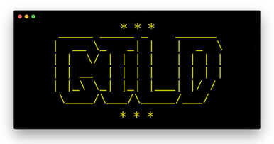

<p align="center"></p>

**G**opher **i**n **LD**LP. Gild is a gopher client for the terminal written in LDPL, a language for programmers. 

**Features:**

- Surf your favorite Gopherholes in glorious technicolor!
- Quick, no-nonsense prompt-based navigation.
- Supports menus, files, and searches. 

## ~ Screencast ~

<p align="center">
<a href="https://asciinema.org/a/p0Ywy6fQBXRZm7sQU4OC5HeJK" target="_blank"></a>
</p>

## ~ Usage ~

    Usage: gild hostname [port [selector]]

    $ gild gopher.black
    $ gild sdf.org 70
    $ gild hngopher.com 70 /live/p1/

## ~ Install ~

Linux and Mac binaries can be downloaded from:

    https://github.com/dvkt/gild/releases

Just unzip/untar the `gild` binary into your `$PATH` get going!

## ~ Building Source ~

1. Install the LDPL programming language and build from master.

```
$ git clone https://github.com/lartu/ldpl
$ cd ldpl/src
$ make
# cp ldpl to /usr/local/bin or something in your $PATH
```

2. With `ldpl` in your path, clone this repo then build it:

    $ make build

3. Now visit your favorite gopher servers!

    $ ./gild bitreich.org

## ~ TODO ~

- [✓] Connect to server and print response
- [✓] Display dir contents in technicolor
- [✓] Prompt-based navigation (show link #s and ask what to do)
- [✓] 0 to go back
- [✓] Render one page at a time
- [✓] Pipe file contents to less (or just use the same infra as menus)
- [✓] Search

## ~ 🐭 ~

       (\~---.
       /   (\-`-/)
      (      ' ' )
       \ (  \_Y_/\
        ""\ \___//
           `w   "       -nathaN 
